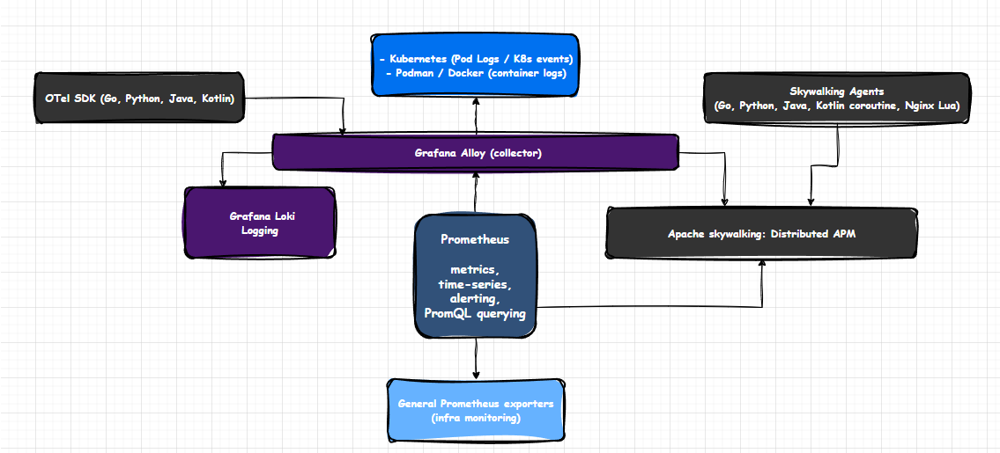

# Observability Reference Stack

* **OTel SDK**: *Go, Python, Java, Kotlin* - OpenTelemetry SDKs for instrumentation
* **Grafana Alloy**: *OTel HTTP collector / K8s and containers runtimes logging*
* **Apache skywalking**: *Distributed APM (HTTP/OTel / agents: Go, Python, Java, Kotlin coroutines, Nginx Lua, K8s events)*
* **Grafana Loki**: *logging and log aggregation*
* **Prometheus**: *metrics collection, storage (time-series) / monitoring and alerting / PromQL querying*

This stack provides a comprehensive observability solution integrating logging, metrics, and distributed tracing across various programming languages and platforms. 

The OTel SDKs and Skywalking Agents facilitates instrumentation in applications. 
Apache Skywalking and Grafana Alloy provide solutions for a distributed APM with a powerful collector and processor (respectively).

Grafana Loki handles log aggregation and querying. The Grafana Alloy ensures that logs from various sources and signals are collected and processed effectively.

Prometheus serves for metrics collection, querying and alerting, ensuring that all components are monitored effectively.
